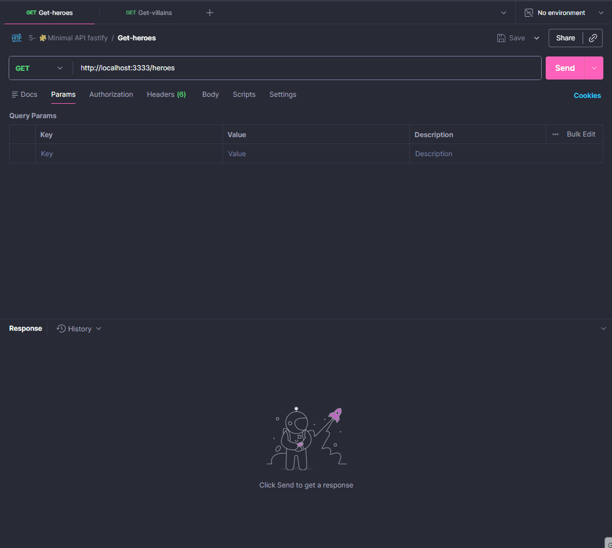

<h1 align="center">Fastify Minimal API</h1>

  
  <a href="#-live-demo">Live Demo</a>&nbsp;&nbsp;&nbsp;|&nbsp;&nbsp;&nbsp;
  <a href="#-screenshots">Screenshots</a>&nbsp;&nbsp;&nbsp;|&nbsp;&nbsp;&nbsp;
  <a href="#-technologies">Technologies</a>&nbsp;&nbsp;&nbsp;|&nbsp;&nbsp;&nbsp;
  <a href="#-how-to-run">How to Run</a>&nbsp;&nbsp;&nbsp;|&nbsp;&nbsp;&nbsp;
  <a href="#-license">License</a>&nbsp;&nbsp;&nbsp;|&nbsp;&nbsp;&nbsp;
  <a href="#-contributing">Contributing</a>&nbsp;&nbsp;&nbsp;|&nbsp;&nbsp;&nbsp;
  <a href="#support">Support</a>  

  

 

## 🌐 Live Demo

  

  <a href="https://fastify-minimal-api.onrender.com/heroes">All heroes</a>

  <a href="https://fastify-minimal-api.onrender.com/villains">All villains</a>

  <a href="https://fastify-minimal-api.onrender.com/heroes/2">Search By ID - Heroes 1 to 6</a>

  <a href="https://fastify-minimal-api.onrender.com/villains/2">Search By ID - Villains 1 to 6</a>

  Tip: Use right-click → “Open in new tab”.

 

## 📸 Screenshots

 

  

 

## 🛠 Technologies

This code source was developed with the following items:

### 📦 Dependencies

- [typescript][typescript-npm] - Superset for application scale JavaScript development
- [tsx][tsx-npm] - TypeScript Execute (tsx): Enable Node.js to run TypeScript
- [tsup][tsup-npm] - Bundle your TypeScript library with no config, powered by esbuild
- [@types/node][@types/node-npm] - type definitions for node

### 📄 Files

- `.gitignore` - Ignore folders like node_modules
- `.env` - Enviroment variables
- `tsconfig.json` - Typescript configure Options

### ⚡ Scripts

- `npm run dist`: Compiles TypeScript files to JavaScript in the dist directory.
- `npm run start:dev`: Runs the server in development mode with environment variables loaded from the .env file.
- `npm run start:watch`: Runs the server in development mode with support for automatic reload on file changes.
- `npm run start:dist`: Compiles the project and runs the compiled version from the dist directory.

 

## ⚙ How to Run

- You need to have <kbd>[Git](https://git-scm.com)</kbd>, <kbd>[NodeJS](https://nodejs.org/en/download/)</kbd> + <kbd>[NPM v10+](https://nodejs.org/en/)</kbd> installed on your machine.
- Clone the project.
- Install the dependencies using <kbd>npm install</kbd>
- Start the server by running <kbd>start:dev</kbd>

 
